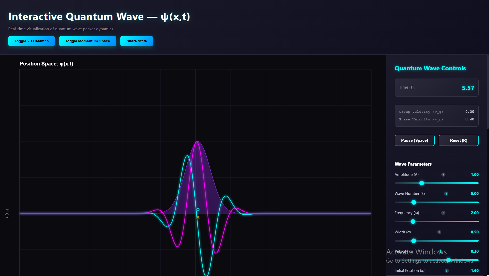

# Quantum Wave Lab 🔬

**Quantum Wave Lab** is a real-time, interactive 1D quantum wave packet simulator that runs entirely in your browser. It provides a visual sandbox for exploring fundamental quantum mechanics concepts, including wave packet evolution, dispersion, potential barriers, and superposition.

---

## ✨ Features

* **Real-time Visualization:** Watch the wave function evolve in time, showing:
    * **Re(ψ):** The real component (cyan).
    * **Im(ψ):** The imaginary component (pink).
    * **|ψ|²:** The probability density (purple filled area).
* **Interactive Controls:** A full UI panel to adjust all wave packet parameters (Amplitude, Wave Number, Frequency, Width, Velocity, Initial Position) in real-time.
* **Physics Modes:**
    * **Potentials:** Add a potential barrier, well, or step to observe quantum tunneling and reflection.
    * **Dispersion:** Enable the physical dispersion relation (ω = ℏk²/2m) to see the wave packet naturally spread over time.
    * **Superposition:** Add a second wave packet to demonstrate quantum interference.
* **Custom Wave Functions:** Define your own `ψ(x,t)` using **math.js** syntax for advanced experiments.
* **Multiple Views:**
    * **Position Space (1D):** The main animation view.
    * **Momentum Space (1D):** Toggle to see the real-time Fourier transform (ψ̃(k)) of the wave packet.
    * **Heatmap (2D):** Switch to a 2D (position vs. time) heatmap to visualize the packet's path and probability density over its history.
* **Analysis Tools:**
    * View real-time expectation values for position ⟨x⟩, momentum ⟨p⟩, and energy ⟨E⟩.
    * Click-to-set packet position.
    * View velocity markers for group (v_g) and phase (v_p) velocity.
* **Recording:** Record your simulation as a **GIF**, **MP4**, or **WebM** file directly from the browser using `CCapture.js`.
* **Share State:** Generate a unique URL that saves your exact simulation parameters to share with others.

---

## 🚀 How to Use

1.  **Run:** Open `index.html` in a modern web browser. (For ES6 module support, it's best to serve it from a local server).
2.  **Interact:**
    * Use the **control panel** on the right to adjust parameters.
    * Press **Pause/Resume** (or **Spacebar**) to control the simulation.
    * Press **Reset** (or **'R'**) to restart the simulation at t=0.
    * **Click** on the canvas (in Position Space) to set the wave packet's initial position.
3.  **Change Views:**
    * Use the **header buttons** to toggle between the 1D animation, the 2D Heatmap, and the Momentum Space view.
4.  **Record:**
    * Go to the **"Recording"** panel.
    * Select your desired format (GIF, MP4, WebM).
    * Click **"Start Recording"**.
    * When finished, click **"Stop Recording"**.
    * Wait for the "Status: Compiling..." message to change to "Ready to Download!".
    * Click **"Download"** to save your file.

---

## 🛠️ Tech Stack

* **Core:** Vanilla JavaScript (ES6 Modules)
* **Rendering:** HTML5 Canvas API
* **Custom Functions:** [math.js](https://mathjs.org/)
* **Recording:** [CCapture.js](https://github.com/spite/ccapture.js/)
* **Structure:** HTML5 & CSS3

---

## 📁 File Structure

* `QM.png`: Project screenshot
* `index.html`: The main HTML entry point
* `style.css`: All styling for the application
* `main.js`: Main app class, initializes engine/UI, runs animation loop
* `quantum-engine.js`: Core physics logic and calculations
* `visualizer.js`: Renders the 1D Position and Momentum space canvas
* `HeatmapVisualizer.js`: Renders the 2D position-vs-time heatmap
* `ui-controls.js`: Dynamically creates and manages the control panel
* `RecordingService.js`: A wrapper for CCapture.js to handle recording
* `counter.js`: (Example counter module, can be removed)

---
